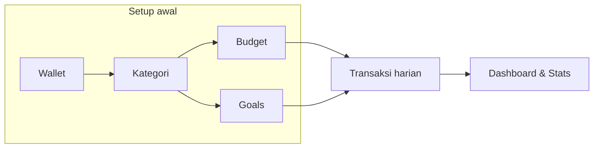
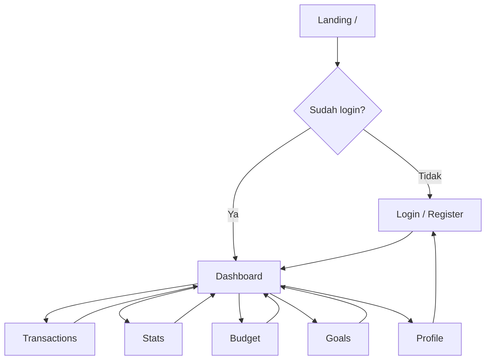
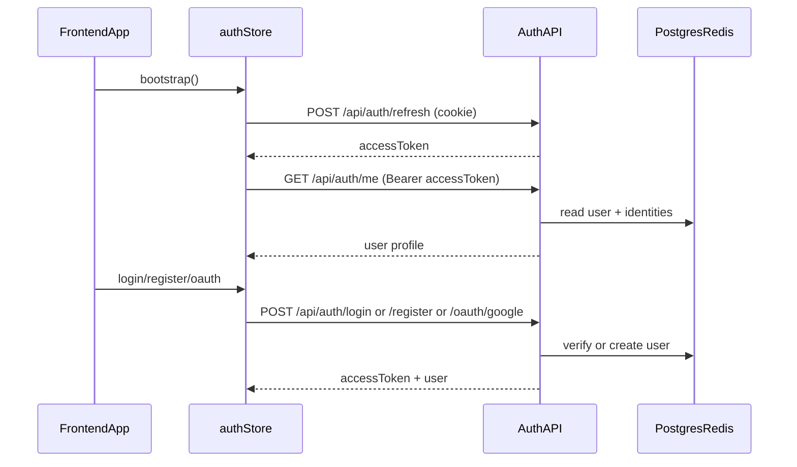

# FinKu

FinKu adalah aplikasi **personal finance** berbasis web: user mencatat pemasukan dan pengeluaran, mengatur budget per kategori, menabung menuju goal, dan melihat ringkasan serta analitik—dalam satu alur yang ringkas dan UI yang konsisten.

Stack: frontend **React 18 + TypeScript + Vite + Tailwind**, backend **Go (chi) + Postgres + Redis + sqlc**, auth **JWT access + refresh cookie**.

---

## Keputusan desain (disepakati)

Bagian ini mengunci perilaku **kategori, transaksi, dan analitik** yang sudah disepakati; implementasi kode mengikutinya.

### Kategori default per user

- Setelah **registrasi** (atau saat **first access** ke domain finansial—bisa dipilih saat coding), sistem **menyalin template kategori default** ke akun user (satu baris per kategori milik `user_id`).
- User **tidak wajib** menyelesaikan wizard “buat kategori dulu” sebelum mencatat transaksi; nilai cepat didapat dari **picker yang sudah terisi**.
- Setiap transaksi **wajib punya `category_id`** di data; UX boleh default ke kategori semisal **“Lainnya”** / terakhir dipakai agar simpan satu ketukan tetap valid tanpa frikasi tinggi.

### Arsip (soft delete), bukan hapus permanen sebagai jalur utama

- Aksi user: **Arsipkan** kategori (bukan “hapus permanen” sebagai default).
- **Data:** kategori ditandai arsip (mis. `archived_at` / `deleted_at`); transaksi lama **tetap** menunjuk ke kategori yang sama—**tidak** ada pemindahan massal otomatis saat arsip, sehingga **histori analitik & budget masa lalu tidak berubah makna** karena relasi transaksi ikut berubah.
- **Picker transaksi baru** hanya menampilkan kategori **aktif** (non-arsip).
- **Pengembalian:** daftar kategori memakai tab atau filter **Aktif | Diarsipkan**; dari tab arsip user bisa **batalkan arsip** (unarchive) sehingga kategori kembali ke picker. Konflik nama dengan kategori aktif baru bisa diatur nanti (mis. wajib rename saat unarchive atau izinkan duplikat nama dengan `id` berbeda).

### Analitik & dashboard tetap sejajar

- **Total** income/expense per periode dihitung dari **transaksi**, bukan dari daftar kategori aktif saja.
- **Breakdown per kategori** (pie, dll.) mengelompokkan transaksi per `category_id` **termasuk** yang menunjuk ke kategori arsip; di UI slice bisa diberi label semisal **“Arsip: …”** atau satu bucket **“Kategori (arsip)”** agar tidak membingungkan.
- Hindari query chart yang hanya `FROM categories WHERE archived IS NULL` lalu join transaksi—itu membuat transaksi kategori arsip “hilang” dari chart padahal total transaksi tetap ada.

### Bulk pindah kategori (opsional, bukan default)

- Memindahkan banyak transaksi ke kategori lain **mengubah histori** analitik & spent per kategori secara retroaktif; tetap sebagai **fitur eksplisit** (“Pindahkan transaksi ke…”) jika dibutuhkan, bukan sebagai syarat saat arsip.

---

## Pengalaman user: flow lengkap (produk target)

Alur di bawah ini mendeskripsikan **apa yang bisa dilakukan user di web FinKu** dari pertama kali datang sampai pemakaian harian. Detail business rules (periode budget, transfer antar-wallet, dll.) bisa Anda rapikan di dokumen desain; README ini memetakan **scope fitur dan urutan pengalaman** yang selaras dengan halaman dan copy di repo.

### 1. Sebelum login (publik)

| Langkah | Yang user lakukan | Tujuan |
|--------|-------------------|--------|
| Landing | Membaca value prop, fitur utama, testimonial (marketing) | Memutuskan mendaftar atau masuk |
| Daftar | Email + password atau jalur setara | Membuat akun |
| Masuk | Email/username + password atau **Google OAuth** | Masuk ke area aplikasi |

Setelah autentikasi sukses, user diarahkan ke **Dashboard** (area terproteksi).

### 2. Onboarding & setup data finansial (setelah login)

Urutan ideal agar data saling konsisten (bisa diwajibkan wizard atau dilonggarkan sesuai desain):

| Tahap | User bisa | Output untuk langkah berikutnya |
|-------|-----------|----------------------------------|
| **Wallet** | Menambah, mengedit, menonaktifkan sumber dana (rekening, e-wallet, cash) | Setiap transaksi bisa diikat ke satu wallet |
| **Kategori** | Default **sudah terisi** per akun; tambah/edit; **arsip** / **batalkan arsip**; tidak perlu setup manual sebelum transaksi pertama | Klasifikasi transaksi + dasar budget & chart; histori tetap konsisten saat arsip |
| **Budget** | Set limit per kategori (per periode, mis. bulanan) | Progress “spent vs limit” di dashboard & halaman Budget |
| **Goals** | Membuat target tabungan (nama, target nominal, deadline opsional), melihat progress | Motivasi & tracking terpisah dari budget operasional |

### 3. Pemakaian harian

| Area | User bisa |
|------|-----------|
| **Transaksi** | Menambah pemasukan/pengeluaran (jumlah, tanggal, deskripsi, wallet, **kategori**—selalu terisi di data, bisa default); mencari; memfilter; melihat riwayat; (target) export data |
| **Dashboard** | Melihat saldo/ringkasan periode, trend pengeluaran, porsi kategori, cuplikan budget, transaksi terbaru, insight/streak (sesuai implementasi) |
| **Budget** | Melihat semua kategori budget, progress, peringatan over-budget; menambah/mengedit limit |
| **Stats** | Analitik: distribusi kategori, agregat per minggu/periode, pola spending |
| **Goals** | Melihat daftar goal, progress %, menambah goal, mengisi progress (sesuai aturan bisnis) |
| **Profil & preferensi** | Nama/email (sesuai kebijakan edit), **username**, **password** / set password, **hubungkan/lepas** Google, preferensi finansial (currency, income, payday—target sinkron API), notifikasi (budget warning, reminder catat, weekly report), dark mode, (opsional) biometric / danger zone reset data |

### 4. Flow navigasi tinggi (di dalam app)

**Rute utama** (lihat [frontend/src/App.tsx](frontend/src/App.tsx)):

| Path | Bagian produk |
|------|----------------|
| `/` | Landing |
| `/login`, `/register` | Autentikasi |
| `/dashboard` | Ringkasan & insight |
| `/transactions` | Riwayat & aksi terkait transaksi |
| `/stats` | Analitik |
| `/budget` | Perencanaan & tracking budget |
| `/goals` | Target tabungan |
| `/profile` | Akun, identitas terhubung, preferensi |
| `/settings` | Redirect ke `/profile` |

**Shell aplikasi** ([frontend/src/components/AppShell.tsx](frontend/src/components/AppShell.tsx)): sidebar (desktop) + bottom navigation (mobile), notifikasi header, aksi global **tambah transaksi** (`+`), logout.

---

## Katalog fitur (ringkas)

Fitur di bawah menggabungkan **yang sudah terlihat di UI** dan **yang dipromosikan di landing** sebagai satu visi produk web.

### Akun & keamanan

- Registrasi & login email/password
- Login / link akun **Google**
- Refresh session (cookie) + token akses
- Logout
- Profil: username, ganti/set password, daftar provider, unlink (sesuai aturan “minimal satu metode login”)
- Preferensi: tema gelap, toggle notifikasi (UI; sinkron backend bisa bertahap)

### Dompet (Wallet)

- CRUD wallet; transaksi memilih wallet sumber/tujuan (termasuk konsep transfer antar-wallet jika produk mendukung)

### Kategori

- **Seed default** ke akun user saat daftar atau first access; user bisa tambah/edit/reorder (sesuai implementasi).
- Income & expense; penamaan + visual (emoji/icon); dipakai di transaksi, chart, dan budget.
- **Arsip** = soft delete: hilang dari picker transaksi baru, transaksi lama tetap terikat; **unarchive** dari daftar “Diarsipkan”.
- Aturan analitik: agregasi dari **transaksi**, breakdown **ikut** kategori arsip dengan label jelas (lihat [Keputusan desain (disepakati)](#keputusan-desain-disepakati)).

### Transaksi

- Catat income / expense dengan metadata (tanggal, judul, jumlah, kategori, wallet); **setiap simpan punya `category_id`** (bawaan form jika user tidak memilih manual).
- Riwayat dengan ringkasan total income/expense per filter periode
- Pencarian & filter (UI menyiapkan placeholder)
- Entry cepat dari tombol `+` global

### Budget

- Limit per kategori per periode; indikator % terpakai; status aman vs over budget
- Link implisit ke agregat transaksi expense pada kategori yang sama

### Goals

- Target nominal, opsional deadline, progress tabungan
- Daftar kartu goal dengan progress bar

### Dashboard & insight

- Saldo / ringkasan periode, income vs expense, sisa budget
- Trend pengeluaran (chart)
- Pie kategori (konsisten dengan total transaksi; termasuk transaksi pada kategori **arsip** di breakdown—lihat keputusan desain)
- Cuplikan budget & transaksi terbaru
- Streak / insight copy (bisa dihubungkan ke data real kemudian)

### Stats

- Distribusi pengeluaran per kategori (pie)—sumber agregasi transaksi, bukan hanya daftar kategori aktif
- Agregat per minggu atau periode lain (bar chart)
- Teks insight tambahan (sesuai desain)

### Engagement & notifikasi (target produk)

- Reminder catat transaksi, peringatan budget, weekly report (landing & profil menyebut konsep ini)
- Streak & badge (landing); implementasi bisa bertahap

---

## Stack teknis

- **Frontend:** React 18, TypeScript, Vite, Tailwind CSS 3, React Router v6, Zustand, Recharts, Framer Motion, Lucide React, Sonner.
- **Backend:** Go, chi router, Postgres, Redis, sqlc, JWT (access di client + refresh via cookie).

---

## Cara menjalankan

- **Frontend:** di folder `frontend/` jalankan `npm install`, lalu `npm run dev` (Vite mem-proxy `/api` ke `http://localhost:8080`).
- **Backend:** di folder `backend/` salin `backend/.env.example` ke `backend/.env`, jalankan migration, lalu `go run ./cmd/server`. Detail env ada di [backend/README.md](backend/README.md).

---

## Status implementasi di repo (saat ini)

Bagian ini membedakan **visi produk** di atas dengan **kode yang sudah jalan**.

| Area | Status |
|------|--------|
| Login, register, refresh, `me`, username, password, identities, OAuth Google, logout | **Terhubung ke API** ([frontend/src/store/auth.ts](frontend/src/store/auth.ts), [backend/cmd/server/main.go](backend/cmd/server/main.go)) |
| Dashboard, Transactions, Budget, Stats, Goals | **Data mock** di masing-masing page (hardcoded) |
| Wallet / kategori / budget / goals / transaksi sebagai domain backend | **Belum** ada tabel & route selain auth |
| Tombol tambah transaksi (`+`) di AppShell | **Placeholder** (toast / tanpa handler) |
| Preferensi finansial penuh di profil | Sebagian **UI only**; field seperti `monthly_income` / `payday` di DB user belum punya flow edit penuh |

### Flow auth (implementasi nyata)

Endpoint auth: `register`, `login`, `oauth/google`, `refresh`, `me`, `password`, `username`, `username/suggest`, `identities`, `logout` pada grup `/api/auth`.

### Sumber mock di frontend (untuk development UI)

- [frontend/src/pages/DashboardPage.tsx](frontend/src/pages/DashboardPage.tsx) — `trendData`, `categoryData`, `budgets`, `latestTx`
- [frontend/src/pages/TransactionsPage.tsx](frontend/src/pages/TransactionsPage.tsx) — array `transactions`
- [frontend/src/pages/BudgetPage.tsx](frontend/src/pages/BudgetPage.tsx) — `budgetItems`
- [frontend/src/pages/StatsPage.tsx](frontend/src/pages/StatsPage.tsx) — `categoryData`, `weeklyData`
- [frontend/src/pages/GoalsPage.tsx](frontend/src/pages/GoalsPage.tsx) — `goals`

### Status backend (schema & route)

- Migration yang ada: [backend/migrations/000001_create_users.up.sql](backend/migrations/000001_create_users.up.sql), [backend/migrations/000002_username_and_identities.up.sql](backend/migrations/000002_username_and_identities.up.sql) (`users`, `user_identities`).
- Route aktif selain health: `/api/auth/*` di [backend/cmd/server/main.go](backend/cmd/server/main.go).

---

## Arah implementasi setelah desain & business logic dikunci

- Kontrak data & CRUD untuk **wallets**, **categories** (termasuk kolom arsip + seed per user), **budgets**, **goals**, **transactions** + endpoint ringkasan untuk dashboard/stats/budget.
- **Seed kategori** saat `register` / OAuth create user atau endpoint idempotent `EnsureDefaultCategories(userID)`.
- Query agregasi dashboard/stats: **dari transaksi** + join kategori (aktif/arsip) untuk label; hindari filter kategori aktif saja pada numerator chart.
- State/cache di frontend untuk resource finansial dan invalidasi setelah mutasi.
- Entry point **+** yang menyimpan transaksi dengan **`category_id` wajib** (default di client/server).
- Aturan periode finansial (kalender vs payday) agar agregasi budget dan chart konsisten.
- Menjembatani preferensi user (`payday`, income, currency) dari profil ke API bila siap.
- Perilaku **budget** saat kategori diarsip / di-unarchive (nonaktifkan limit vs restore) ditetapkan saat implementasi halaman Budget.

README ini boleh diperbarui lagi untuk hal yang belum dikunci (mis. definisi transfer antar-wallet, aturan nama duplikat saat unarchive, snapshot `category_name` pada transaksi).
