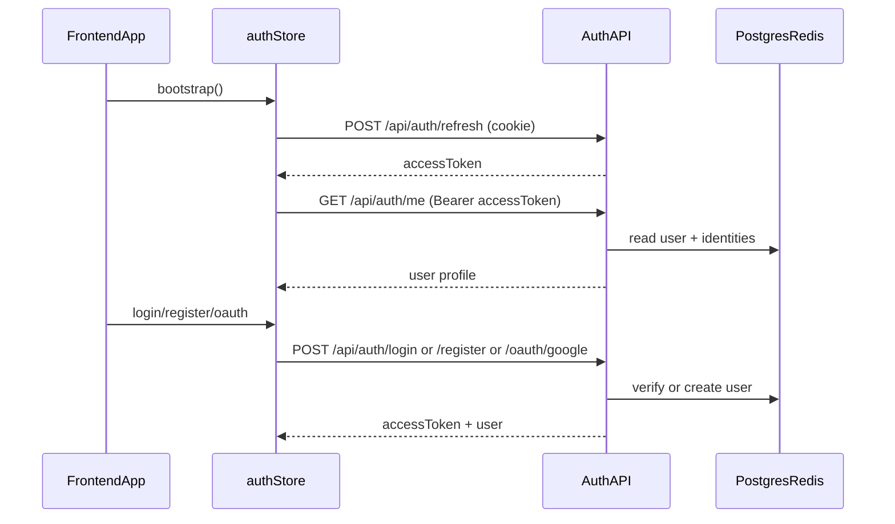
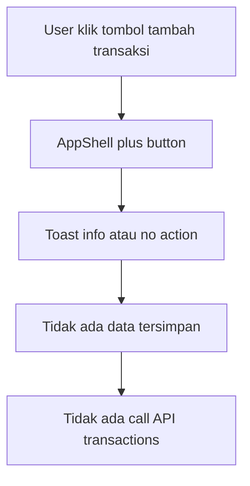

# FinKu

FinKu adalah aplikasi personal finance dengan frontend React dan backend Go. Saat ini proyek masih di fase prototype: flow autentikasi sudah real ke backend, sedangkan flow pencatatan uang (transactions, categories, budget, goals, stats) masih mock di sisi frontend.

## Stack

- Frontend: React 18, TypeScript, Vite, Tailwind CSS 3, React Router v6, Zustand, Recharts, Framer Motion, Lucide React, Sonner.
- Backend: Go, chi router, Postgres, Redis, sqlc, JWT (access token in-memory + refresh token via cookie).

## Cara Menjalankan

- Frontend: di folder `frontend/` jalankan `npm install`, lalu `npm run dev` (Vite proxy `/api` ke `http://localhost:8080`).
- Backend: di folder `backend/` copy `backend/.env.example` ke `backend/.env`, jalankan migration, lalu `go run ./cmd/server`. Detail env ada di [backend/README.md](backend/README.md).

## Status Fitur Saat Ini

- [real] `login`, `register`, `profile` sudah terhubung ke auth API melalui [frontend/src/store/auth.ts](frontend/src/store/auth.ts).
- [mock] `dashboard`, `transactions`, `budget`, `stats`, `goals` masih pakai data hardcoded di masing-masing page.
- [placeholder] tombol tambah transaksi (`+`) belum punya flow simpan:
  - Desktop floating button di [frontend/src/components/AppShell.tsx](frontend/src/components/AppShell.tsx) belum memiliki `onClick`.
  - Mobile center button di [frontend/src/components/AppShell.tsx](frontend/src/components/AppShell.tsx) baru menampilkan `toast.info`.

## Flow Auth (Sudah Real)

Endpoint auth aktif di [backend/cmd/server/main.go](backend/cmd/server/main.go) pada grup `/api/auth`: `register`, `login`, `oauth/google`, `refresh`, `me`, `password`, `username`, `username/suggest`, `identities`, `logout`.

## Flow Pencatatan Uang (Current State)

Saat ini tidak ada flow pencatatan uang yang aktif. Belum ada proses input transaksi yang tersimpan ke backend maupun state terpusat untuk domain finansial.

Sumber data mock per halaman:

- [frontend/src/pages/DashboardPage.tsx](frontend/src/pages/DashboardPage.tsx) lines 21-50: `trendData`, `categoryData`, `budgets`, `latestTx`.
- [frontend/src/pages/TransactionsPage.tsx](frontend/src/pages/TransactionsPage.tsx) lines 4-11: `transactions`.
- [frontend/src/pages/BudgetPage.tsx](frontend/src/pages/BudgetPage.tsx) lines 4-9: `budgetItems`.
- [frontend/src/pages/StatsPage.tsx](frontend/src/pages/StatsPage.tsx) lines 13-26: `categoryData`, `weeklyData`.
- [frontend/src/pages/GoalsPage.tsx](frontend/src/pages/GoalsPage.tsx) lines 4-8: `goals`.

Konsep yang sudah muncul di mock UI tapi belum punya model data/flow real:

- Wallet (contoh: `BCA`, `GoPay`).
- Category (saat ini string bebas + emoji).
- Budget period (per bulan/periode belum terdefinisi real).
- Goal deadline/progress (masih statis).

## Status Backend Saat Ini

- Schema yang ada baru `users` dan `user_identities`:
  - [backend/migrations/000001_create_users.up.sql](backend/migrations/000001_create_users.up.sql)
  - [backend/migrations/000002_username_and_identities.up.sql](backend/migrations/000002_username_and_identities.up.sql)
- Routes yang aktif saat ini baru `/api/health` dan `/api/auth/*` di [backend/cmd/server/main.go](backend/cmd/server/main.go).
- Belum ada tabel/route untuk `transactions`, `categories`, `budgets`, `goals`, atau `wallets`.
- Field `monthly_income` dan `payday` sudah ada di tabel `users`, tetapi belum ada flow UI/endpoint yang dipakai untuk edit preferensi finansial tersebut.

## Gap Sebelum Money Flow Bisa Jalan

- Perlu domain type dan kontrak data untuk transaksi, kategori, budget, goals, dan wallet.
- Perlu layer state/cache untuk resource finansial (list, detail, summary, dan invalidasi setelah mutasi).
- Perlu entry point tambah transaksi yang benar-benar menyimpan data.
- Perlu endpoint CRUD + endpoint summary/agregasi untuk dashboard, stats, dan budget.
- Perlu linking transaksi ke kategori/budget agar progres budget bukan angka statis.
- Perlu definisi periode finansial (termasuk relasi dengan `payday`) agar perhitungan konsisten.
